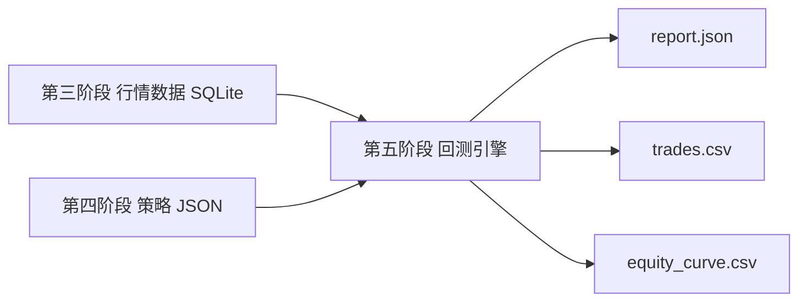

# 第五阶段交付物：回测引擎 MVP

版本：v0.1  
阶段：第五阶段 - 回测引擎  
日期：2026-06-20  
前置依赖：

- 第三阶段：A 股行情数据模块。
- 第四阶段：策略 DSL 与校验器。

目标：读取策略 JSON，从行情数据库获取 A 股 K 线数据，执行买卖规则、仓位规则和基础风控，输出交易记录、权益曲线和核心回测指标。

## 1. 阶段范围

本阶段完成单标的回测引擎 MVP。

已支持：

- A 股单标的。
- 日线、60 分钟、30 分钟、15 分钟数据结构。
- 从 SQLite 行情库读取 K 线。
- 读取第四阶段策略 JSON。
- 条件组买入和卖出。
- `all` / `any` 条件组合。
- 价格表达式。
- 常量表达式。
- 基础指标表达式：MA、EMA、RSI、VOLUME_MA、RETURN、VOLATILITY。
- 上穿、下穿、大于、小于、等于、大于等于、小于等于。
- 按资金比例下单。
- 手续费。
- 滑点。
- 止损。
- 止盈。
- 最大持仓 K 线。
- 最大回撤停止开新仓。
- 输出 JSON 报告。
- 输出交易明细 CSV。
- 输出权益曲线 CSV。

暂不支持：

- 多标的组合。
- 多仓位分批买卖。
- A 股 T+1 卖出限制。
- 涨跌停无法成交处理。
- 停牌处理。
- 分红送转复权真实计算。
- 参数优化。
- 真实撮合队列。
- 实盘交易。

## 2. 交付文件

| 文件 | 说明 |
|---|---|
| `backtest_module/backtest_engine.py` | 回测引擎主程序 |
| `backtest_module/backtest-engine-delivery.md` | 第五阶段交付说明 |
| `strategy_module/samples/price_breakout_demo_strategy.json` | 用于演示成交闭环的样例策略 |
| `backtest_module/output/price_breakout_demo/report.json` | 价格突破演示策略回测报告 |
| `backtest_module/output/price_breakout_demo/trades.csv` | 价格突破演示策略交易明细 |
| `backtest_module/output/price_breakout_demo/equity_curve.csv` | 价格突破演示策略权益曲线 |
| `backtest_module/output/double_ma_sample/report.json` | 双均线样例回测报告 |
| `backtest_module/output/double_ma_sample/trades.csv` | 双均线样例交易明细 |
| `backtest_module/output/double_ma_sample/equity_curve.csv` | 双均线样例权益曲线 |

## 3. 输入

### 3.1 策略 JSON

回测引擎读取第四阶段定义的策略 DSL，例如：

```powershell
strategy_module\samples\price_breakout_demo_strategy.json
```

关键字段：

- `universe.symbols[0]`
- `data.frequency`
- `data.start_date`
- `data.end_date`
- `entry`
- `exit`
- `position`
- `execution`
- `risk`

### 3.2 行情数据库

默认读取：

```powershell
data_module\market_data.sqlite
```

查询条件来自策略 JSON：

```text
symbol + frequency + start_date + end_date
```

## 4. 输出

### 4.1 report.json

包含：

- 策略 ID。
- 策略名称。
- 股票代码。
- 数据频率。
- 回测区间。
- 核心指标。
- 交易明细。
- 权益曲线。

### 4.2 trades.csv

字段：

| 字段 | 说明 |
|---|---|
| symbol | 股票代码 |
| entry_time | 买入时间 |
| exit_time | 卖出时间 |
| entry_price | 买入成交价，含滑点 |
| exit_price | 卖出成交价，含滑点 |
| quantity | 成交股数 |
| gross_pnl | 毛收益 |
| net_pnl | 扣费后收益 |
| return_pct | 单笔收益率 |
| entry_fee | 买入手续费 |
| exit_fee | 卖出手续费 |
| exit_reason | 卖出原因 |
| holding_bars | 持仓 K 线数 |

### 4.3 equity_curve.csv

字段：

| 字段 | 说明 |
|---|---|
| trade_time | 时间 |
| cash | 现金 |
| position_qty | 持仓数量 |
| close | 当前收盘价 |
| equity | 当前总权益 |
| drawdown_pct | 当前回撤 |

## 5. 核心指标

当前输出：

| 指标 | 说明 |
|---|---|
| initial_cash | 初始资金 |
| final_equity | 最终权益 |
| total_return | 总收益率 |
| annualized_return | 年化收益率 |
| max_drawdown | 最大回撤 |
| win_rate | 胜率 |
| profit_factor | 盈亏比 |
| trade_count | 交易次数 |
| average_holding_bars | 平均持仓 K 线数 |
| total_fees | 手续费总额 |
| sharpe | 夏普比率 |

## 6. 运行命令

以下命令使用 Codex 内置 Python 验证通过。

### 6.1 运行价格突破演示策略

```powershell
& 'C:\Users\huawei\.cache\codex-runtimes\codex-primary-runtime\dependencies\python\python.exe' backtest_module\backtest_engine.py strategy_module\samples\price_breakout_demo_strategy.json --db data_module\market_data.sqlite --output-dir backtest_module\output\price_breakout_demo
```

验证结果：

```json
{
  "trade_count": 1,
  "total_return": -0.002785,
  "max_drawdown": 0.005415,
  "total_fees": 17.091665
}
```

### 6.2 运行双均线样例策略

```powershell
& 'C:\Users\huawei\.cache\codex-runtimes\codex-primary-runtime\dependencies\python\python.exe' backtest_module\backtest_engine.py strategy_module\samples\double_ma_strategy.json --db data_module\market_data.sqlite --output-dir backtest_module\output\double_ma_sample
```

验证结果：

```json
{
  "trade_count": 0,
  "total_return": 0.0,
  "max_drawdown": 0.0
}
```

双均线样例无交易是合理结果，因为当前样例行情只有 5 根日线，而策略使用 MA20，需要更长历史数据。

## 7. 成交逻辑

### 7.1 买入

当满足 `entry` 条件且当前没有持仓：

1. 根据 `execution.entry_price` 确定成交价。
2. 买入价格加入滑点。
3. 根据 `position.order_size_value` 计算投入资金。
4. 扣除手续费。
5. 记录持仓数量、买入价、买入时间。

### 7.2 卖出

当已有持仓时，满足任一情况会卖出：

- `exit` 条件满足。
- 触发止损。
- 触发止盈。
- 达到最大持仓 K 线数。

卖出价格扣除滑点，卖出后计算毛收益、净收益、手续费和持仓周期。

### 7.3 最大回撤

当权益曲线回撤达到 `risk.max_drawdown_pct` 时，引擎停止开新仓。

## 8. 与前面阶段的衔接



## 9. 当前限制与下一步

当前引擎已经能完成 MVP 回测闭环，但要接近真实 A 股交易，还需要补充：

- A 股交易日历。
- T+1 卖出规则。
- 最小交易单位 100 股。
- 涨跌停无法成交。
- 停牌日跳过。
- 印花税与最低佣金。
- 更长历史行情数据。
- 图表化回测报告。

下一阶段建议进入“回测报告可视化”，把 `report.json`、`trades.csv` 和 `equity_curve.csv` 展示到第二阶段原型页面中。
