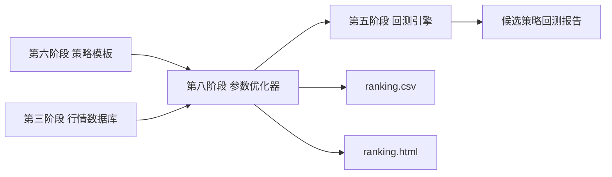

# 第八阶段交付物：参数优化 MVP

版本：v0.1  
阶段：第八阶段 - 参数优化  
日期：2026-06-20  
前置依赖：

- 第三阶段：A 股行情数据模块。
- 第四阶段：策略 DSL。
- 第五阶段：回测引擎。
- 第六阶段：策略模板库。
- 第七阶段：可视化报告。

目标：对策略参数进行网格搜索，批量生成策略变体、运行回测、排序结果，并输出排行榜 CSV、JSON 和 HTML。

## 1. 阶段范围

本阶段完成参数优化 MVP。

已完成：

- 参数优化配置文件。
- 参数网格展开。
- 策略 JSON 自动变体生成。
- 批量回测。
- 按目标指标排序。
- 输出优化结果 `summary.json`。
- 输出排行榜 `ranking.csv`。
- 输出排行榜页面 `ranking.html`。
- 保存每个候选策略的 `strategy.json`、`report.json`、`trades.csv`、`equity_curve.csv`。

暂不包含：

- 随机搜索。
- 贝叶斯优化。
- 遗传算法。
- 样本内/样本外切分。
- Walk-forward 测试。
- 参数热力图。
- 多进程加速。
- 真实长周期数据。

## 2. 交付文件

| 文件 | 说明 |
|---|---|
| `optimization_module/parameter_optimizer.py` | 参数优化器 |
| `optimization_module/configs/price_breakout_grid.json` | 价格突破策略网格搜索配置 |
| `optimization_module/output/price_breakout_grid/summary.json` | 优化结果汇总 |
| `optimization_module/output/price_breakout_grid/ranking.csv` | 参数排行榜 |
| `optimization_module/output/price_breakout_grid/ranking.html` | 参数排行榜可视化页面 |
| `optimization_module/output/price_breakout_grid/candidates/` | 每个候选策略的回测输出 |
| `optimization_module/optimization-delivery.md` | 第八阶段交付说明 |

## 3. 优化配置

配置文件：

```text
optimization_module/configs/price_breakout_grid.json
```

核心结构：

```json
{
  "optimization_id": "opt_price_breakout_grid",
  "name": "价格突破策略参数网格搜索",
  "base_strategy": "template_module/templates/price_breakout.json",
  "db_path": "data_module/market_data.sqlite",
  "objective": {
    "primary_metric": "total_return",
    "direction": "max"
  },
  "parameters": [
    {
      "name": "entry_threshold",
      "path": "entry.conditions.0.right.value",
      "values": [1660, 1670, 1680, 1690]
    }
  ]
}
```

## 4. 本次优化参数

本阶段对价格突破策略进行 3 组参数搜索：

| 参数 | DSL 路径 | 候选值 |
|---|---|---|
| 买入阈值 | `entry.conditions.0.right.value` | `1660`, `1670`, `1680`, `1690` |
| 卖出阈值 | `exit.conditions.0.right.value` | `1660`, `1670`, `1680` |
| 仓位比例 | `position.order_size_value` | `0.2`, `0.3`, `0.4` |

参数组合数量：

```text
4 × 3 × 3 = 36
```

## 5. 运行命令

使用 Codex 内置 Python：

```powershell
& 'C:\Users\huawei\.cache\codex-runtimes\codex-primary-runtime\dependencies\python\python.exe' optimization_module\parameter_optimizer.py optimization_module\configs\price_breakout_grid.json --output-dir optimization_module\output\price_breakout_grid
```

## 6. 输出结果

输出目录：

```text
optimization_module/output/price_breakout_grid
```

目录结构：

```text
price_breakout_grid/
  summary.json
  ranking.csv
  ranking.html
  candidates/
    candidate_001/
      strategy.json
      report.json
      trades.csv
      equity_curve.csv
    candidate_002/
      ...
```

## 7. 最佳结果

本次网格搜索最佳组合：

| 指标 | 值 |
|---|---:|
| 买入阈值 | `1680` |
| 卖出阈值 | `1670` |
| 仓位比例 | `0.2` |
| 总收益率 | `-0.1802%` |
| 最大回撤 | `0.3507%` |
| 交易次数 | `1` |
| 手续费 | `11.059312` |
| 夏普比率 | `-2.916721` |

说明：当前样例行情只有 5 根日线，优化结果只用于验证参数优化链路，不代表真实策略效果。

## 8. 排序逻辑

主目标：

```text
total_return 最大化
```

平局时依次比较：

1. `max_drawdown` 最小化。
2. `trade_count` 最大化。

## 9. 与前面阶段的衔接



## 10. 后续扩展建议

下一步可扩展：

- 对 MA 周期、RSI 阈值、止损止盈等更多参数优化。
- 增加样本内/样本外验证，降低过拟合。
- 增加参数热力图。
- 增加多策略对比。
- 增加并行回测。
- 接入更长 A 股历史数据。

第八阶段完成后，项目已经具备从模板创建策略、调整参数、批量回测、查看排行榜的完整研究链路。
