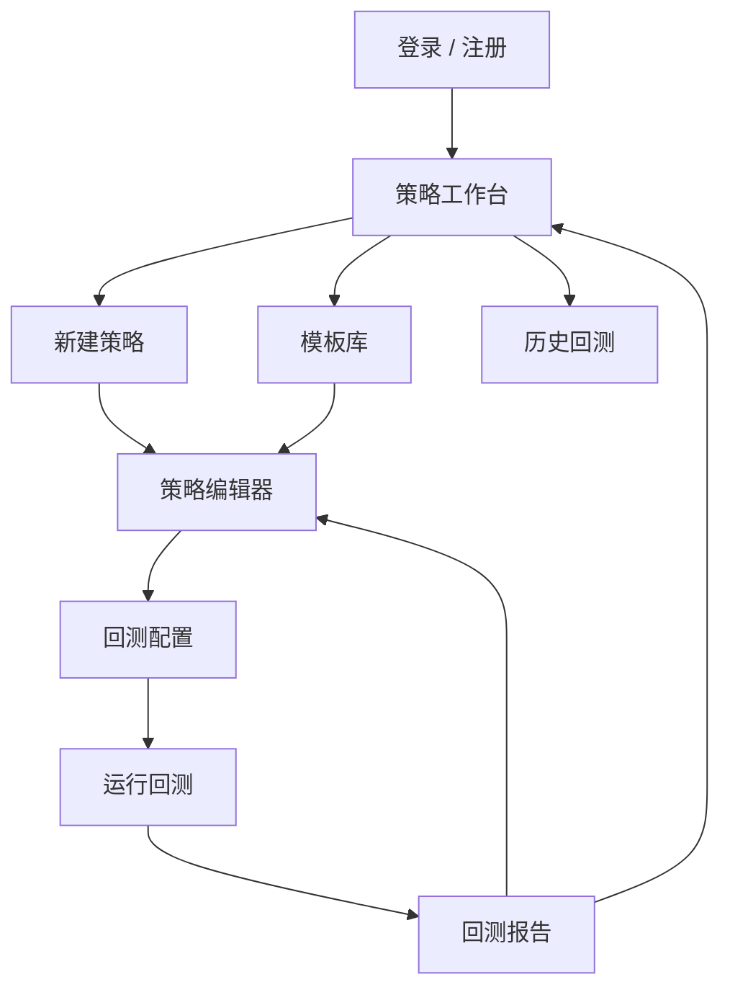

# 量化模型自由编辑平台原型设计说明书

版本：v0.1  
阶段：第二阶段 - 原型设计  
日期：2026-06-20  
依赖文档：`quant-model-platform-prd.md`  
本阶段边界更新：初版应用仅面向股票市场，优先支持中国 A 股，不支持加密货币、外汇、期货与实盘交易。

## 1. 原型目标

第二阶段的目标是把第一阶段 PRD 中的功能需求转化为可理解、可评审、可开发拆分的产品界面原型。

本阶段交付物包括：

- 页面信息架构。
- 核心用户流程。
- 低保真线框说明。
- 关键交互规则。
- 静态 HTML 原型。

## 2. 产品范围修订

根据最新需求，MVP 市场范围调整为：

| 项目 | 初版选择 |
|---|---|
| 市场 | 中国 A 股 |
| 标的类型 | 沪深 A 股单只股票 |
| 数据频率 | 日线、60 分钟、30 分钟、15 分钟 |
| 数据字段 | 开盘价、最高价、最低价、收盘价、成交量、成交额、复权价格 |
| 回测方式 | 单标的历史回测 |
| 暂不支持 | 加密货币、港股、美股、期货、外汇、Tick 数据、Level 2、实盘交易 |

## 3. MVP 页面地图



## 4. 全局导航结构

初版采用桌面端 Web 应用布局：

- 左侧主导航：工作台、策略、模板、回测记录、数据中心。
- 顶部区域：当前策略名称、保存状态、运行回测按钮、用户入口。
- 主内容区：根据页面展示列表、编辑器或报告。
- 右侧辅助区：策略摘要、参数预览、校验结果或回测摘要。

移动端不是 MVP 重点，仅保证基础可访问，不进行复杂交互优化。

## 5. 页面 1：登录 / 注册

### 页面目标

让用户进入个人策略空间。

### 核心元素

- 邮箱输入框。
- 密码输入框。
- 登录按钮。
- 注册入口。
- 找回密码入口。
- 风险提示短文案。

### 交互规则

- 未登录用户访问策略页面时跳转登录页。
- 登录成功后进入策略工作台。
- 登录失败时在表单下方显示错误原因。

## 6. 页面 2：策略工作台

### 页面目标

帮助用户快速查看已有策略、创建新策略、继续最近回测。

### 核心区域

| 区域 | 内容 |
|---|---|
| 顶部摘要 | 策略总数、最近回测、最佳收益、最大回撤提醒 |
| 策略列表 | 策略名称、标的、频率、最近回测收益、更新时间 |
| 快速入口 | 新建空白策略、从模板创建、查看回测记录 |
| 最近回测 | 展示最近 3 条回测结果 |

### 关键操作

- 新建策略。
- 复制策略。
- 打开策略编辑器。
- 打开回测报告。
- 删除策略。

### 空状态

当用户没有策略时，显示两个主要入口：

- 从模板创建。
- 创建空白策略。

## 7. 页面 3：模板库

### 页面目标

降低初学者启动成本。

### MVP 模板

| 模板 | 默认频率 | 适用风格 |
|---|---|---|
| 双均线趋势策略 | 日线 | 趋势跟随 |
| RSI 超买超卖策略 | 日线 | 波段反转 |
| MACD 趋势策略 | 日线 / 60 分钟 | 趋势确认 |
| 布林带均值回归策略 | 日线 | 均值回归 |
| 成交量突破策略 | 60 分钟 | 短线突破 |

### 模板卡片信息

- 模板名称。
- 策略类型。
- 默认指标。
- 风险等级。
- 使用按钮。

## 8. 页面 4：策略编辑器

### 页面目标

让用户在不写代码的情况下搭建 A 股量化策略。

### 布局

| 区域 | 作用 |
|---|---|
| 左侧步骤栏 | 基础信息、数据、买入规则、卖出规则、仓位风控 |
| 中间编辑区 | 当前步骤的表单和规则编辑 |
| 右侧摘要栏 | 策略 JSON 摘要、校验结果、待完善项 |

### 4.1 基础信息

字段：

- 策略名称。
- 策略描述。
- 策略类型：趋势、反转、突破、均值回归。
- 默认股票池：单只股票。

### 4.2 数据设置

字段：

- 市场：A 股。
- 股票代码：如 `600519.SH`、`000001.SZ`。
- 复权方式：前复权、后复权、不复权。
- 频率：日线、60 分钟、30 分钟、15 分钟。
- 回测区间。

### 4.3 买入规则

规则编辑器采用条件块：

```text
当 [MA] [5] [上穿] [MA] [20]
并且 [成交量] [大于] [过去 20 日均量] [1.5 倍]
则 [下一根 K 线开盘价] 买入
```

支持条件：

- 大于。
- 小于。
- 等于。
- 上穿。
- 下穿。
- 连续 N 根 K 线满足。

### 4.4 卖出规则

支持：

- 指标条件卖出。
- 固定止盈。
- 固定止损。
- 持有周期卖出。

示例：

```text
当 [MA] [5] [下穿] [MA] [20]
或 [单笔亏损] [达到] [8%]
则 [下一根 K 线开盘价] 卖出
```

### 4.5 仓位与风控

字段：

- 初始资金。
- 单次买入仓位。
- 最大持仓比例。
- 手续费率。
- 滑点比例。
- 最大回撤停止交易。
- 单笔止损。
- 单笔止盈。

### 校验规则

保存策略前必须通过：

- 策略名称不为空。
- 股票代码不为空。
- 至少有一个买入条件。
- 至少有一个卖出条件或止损条件。
- 单次仓位不能超过最大持仓比例。
- 回测开始日期早于结束日期。

## 9. 页面 5：回测配置

### 页面目标

让用户在运行前确认数据、资金和交易成本。

### 核心字段

- 股票代码。
- 股票名称。
- 回测频率。
- 开始日期。
- 结束日期。
- 初始资金。
- 手续费率。
- 滑点比例。
- 买入成交价设定。
- 卖出成交价设定。

### 操作

- 运行回测。
- 保存配置。
- 返回编辑器。

### 状态

- 待运行。
- 排队中。
- 运行中。
- 成功。
- 失败。

## 10. 页面 6：回测报告

### 页面目标

帮助用户判断策略是否值得继续优化。

### 顶部指标

- 总收益率。
- 年化收益率。
- 最大回撤。
- 夏普比率。
- 胜率。
- 交易次数。
- 手续费总额。

### 图表区域

- 权益曲线。
- 回撤曲线。
- 股票价格走势与买卖点。

### 表格区域

- 交易明细。
- 每日权益。
- 策略规则快照。

### 关键操作

- 复制为新策略。
- 返回编辑器调整参数。
- 导出报告。
- 对比历史回测。

## 11. 页面 7：回测记录

### 页面目标

用户可以回看每次运行结果。

### 表格字段

- 回测时间。
- 策略名称。
- 股票代码。
- 频率。
- 区间。
- 总收益率。
- 最大回撤。
- 夏普比率。
- 状态。

### 操作

- 打开报告。
- 复制配置。
- 删除记录。

## 12. 页面 8：数据中心

### 页面目标

让用户理解当前可用的 A 股数据范围。

### MVP 内容

- 支持的股票列表。
- 数据频率覆盖。
- 最近更新时间。
- 数据缺失提示。

第一版不需要开放复杂数据管理，只提供可用性展示和缺失提示。

## 13. 核心用户流程

### 流程 A：从模板创建策略

1. 用户登录。
2. 进入策略工作台。
3. 点击模板库。
4. 选择“双均线趋势策略”。
5. 系统打开策略编辑器并填入默认规则。
6. 用户输入 A 股代码，例如 `600519.SH`。
7. 用户调整 MA 参数和仓位。
8. 点击保存。
9. 点击运行回测。
10. 查看回测报告。

### 流程 B：创建空白策略

1. 用户点击新建策略。
2. 填写策略名称。
3. 选择 A 股标的与频率。
4. 添加买入条件。
5. 添加卖出条件和止损。
6. 设置仓位。
7. 保存并运行回测。

### 流程 C：回测后优化

1. 用户查看回测报告。
2. 发现最大回撤过高。
3. 点击返回编辑器。
4. 降低单次仓位或增加止损。
5. 保存为新版本。
6. 再次运行回测。
7. 在回测记录中对比结果。

## 14. 低保真线框

### 策略工作台

```text
+---------------------------------------------------------------+
| AQuant Studio               [新建策略] [从模板创建] [用户]       |
+------------+--------------------------------------------------+
| 工作台      | 策略总数  最近回测  最佳收益  风险提醒              |
| 策略        +--------------------------------------------------+
| 模板        | 我的策略                                          |
| 回测记录    | 策略名称     标的       频率      收益     操作      |
| 数据中心    | 双均线策略   600519.SH  日线      12.4%   打开      |
|             | RSI 策略     000001.SZ  60分钟    -2.1%   打开      |
+------------+--------------------------------------------------+
```

### 策略编辑器

```text
+---------------------------------------------------------------+
| 双均线趋势策略                       [保存] [运行回测]           |
+------------+-------------------------------------+------------+
| 基础信息    | 买入规则                             | 策略摘要    |
| 数据设置    | 当 MA(5) 上穿 MA(20)                 | A股         |
| 买入规则    | 并且 成交量 > 20日均量 * 1.5          | 600519.SH   |
| 卖出规则    | [+ 添加条件]                          | 校验通过    |
| 仓位风控    |                                     | JSON预览    |
+------------+-------------------------------------+------------+
```

### 回测报告

```text
+---------------------------------------------------------------+
| 回测报告：双均线趋势策略 / 600519.SH             [复制策略]       |
+---------------------------------------------------------------+
| 总收益  年化收益  最大回撤  夏普比率  胜率  交易次数              |
+---------------------------------------------------------------+
| 权益曲线                                                        |
| [                         chart area                         ] |
+---------------------------------------------------------------+
| 交易明细                                                        |
| 买入日期  卖出日期  买入价  卖出价  收益率  手续费                |
+---------------------------------------------------------------+
```

## 15. 交互细节

### 策略保存

- 用户修改任意规则后，顶部显示“未保存”。
- 点击保存后显示“已保存”。
- 保存失败时保留当前编辑内容，并显示失败原因。

### 规则编辑

- 新增条件默认使用 MA 指标。
- 用户可以切换指标、周期、比较符和值。
- 删除条件前需要确认。
- 条件组支持“全部满足”和“任意满足”。

### 回测运行

- 点击运行回测前先进行规则校验。
- 校验失败时跳转到对应配置区域。
- 运行中按钮进入 loading 状态。
- 运行完成后自动进入回测报告。

### 错误提示

错误提示需要直接指出用户能修改的内容，例如：

- “请至少添加一个卖出条件或设置止损比例。”
- “单次买入仓位不能大于最大持仓比例。”
- “当前股票在所选时间范围内没有 15 分钟线数据。”

## 16. 原型验收标准

第二阶段完成后，应满足：

- 能解释 MVP 的主要页面。
- 能跑通从创建策略到查看回测报告的主流程。
- 能明确 A 股初版产品边界。
- 能支撑后续 UI 设计和前后端任务拆分。
- 能作为第三阶段技术方案的输入。

## 17. 第二阶段结论

第二阶段建议将产品原型聚焦在“策略编辑器”和“回测报告”两处。工作台和模板库负责降低进入门槛，数据中心只做基础说明，不在 MVP 中引入复杂数据管理。

下一阶段进入技术方案时，应重点设计：

- A 股行情数据结构。
- 可视化策略规则 JSON。
- 回测任务执行流程。
- 指标计算与结果存储模型。
