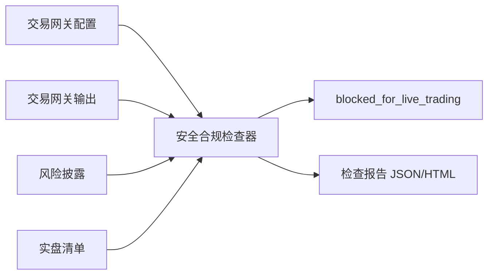

# 第十一阶段交付物：安全与合规层 MVP

版本：v0.1  
阶段：第十一阶段 - 安全与合规  
日期：2026-06-20  
前置依赖：

- 第十阶段：交易网关与沙箱券商适配器。
- 第九阶段：模拟盘。
- 第五阶段：回测引擎。

目标：为量化策略平台增加实盘前安全检查、风险披露、审计检查和上线阻断机制。当前阶段继续禁止真实交易。

## 1. 阶段结论

当前项目状态：

```text
blocked_for_live_trading
```

含义：

- 当前沙箱安全检查通过。
- 当前不得进入真实资金实盘交易。
- 后续接入真实券商前，必须完成生产阻断项。

## 2. 交付文件

| 文件 | 说明 |
|---|---|
| `security_compliance_module/security_compliance_checker.py` | 安全与合规检查器 |
| `security_compliance_module/configs/security_policy.json` | 安全策略配置 |
| `security_compliance_module/disclosures/risk_disclosure_zh.md` | 中文风险披露与免责声明 |
| `security_compliance_module/live-readiness-checklist.md` | 实盘上线前检查清单 |
| `security_compliance_module/output/security_compliance_report.json` | 检查结果 JSON |
| `security_compliance_module/output/security_compliance_report.html` | 检查结果 HTML 报告 |
| `security_compliance_module/security-compliance-delivery.md` | 第十一阶段交付说明 |

## 3. 检查器运行命令

使用 Codex 内置 Python：

```powershell
& 'C:\Users\huawei\.cache\codex-runtimes\codex-primary-runtime\dependencies\python\python.exe' security_compliance_module\security_compliance_checker.py --output-dir security_compliance_module\output
```

## 4. 检查结果

本次检查结果：

| 项目 | 结果 |
|---|---:|
| 总状态 | `blocked_for_live_trading` |
| 通过检查 | `21` |
| 失败检查 | `0` |
| 检查订单数 | `2` |
| 检查成交数 | `1` |
| 检查审计事件数 | `5` |

注意：`失败检查 = 0` 不代表可以实盘。它表示当前沙箱阶段的安全约束被正确执行；生产实盘仍被明确阻断。

## 5. 已检查安全项

| 检查项 | 结果 | 说明 |
|---|---|---|
| 实盘开关关闭 | 通过 | `live_trading_enabled = false` |
| 沙箱模式 | 通过 | 当前运行在 `sandbox` |
| 审计日志开启 | 通过 | `write_audit_log = true` |
| 账户状态写入 | 通过 | `write_account_state = true` |
| 禁止裸卖空 | 通过 | `reject_short_sell = true` |
| 最大订单金额 | 通过 | `max_order_value = 30000` |
| 每日订单限制 | 通过 | `daily_order_limit = 20` |
| 标的白名单 | 通过 | 限定 A 股样例标的 |
| 审计日志存在 | 通过 | `audit_log.csv` 非空 |
| 账户状态存在 | 通过 | `account_state.json` 非空 |
| 订单记录存在 | 通过 | `orders.csv` 非空 |
| 成交记录存在 | 通过 | `fills.csv` 非空 |
| 风控拒单审计 | 通过 | 已验证超额订单拒单 |
| 风险披露文本 | 通过 | 已包含核心免责声明 |
| 实盘检查清单 | 通过 | 已明确当前不得实盘 |

## 6. 生产阻断项

当前不能实盘的原因：

1. 尚未评审真实券商适配器。
2. 尚未实现密钥保险库和密钥轮换。
3. 尚未完成法律/合规评估。
4. 尚未实现实盘紧急停止机制。
5. 尚未完整实现 A 股 T+1、一手限制、涨跌停、停牌、印花税等规则。

## 7. 风险披露内容

已交付中文风险披露：

```text
security_compliance_module/disclosures/risk_disclosure_zh.md
```

覆盖内容：

- 非投资建议。
- 回测不代表未来表现。
- 模拟盘不等于实盘。
- 用户自行承担风险。
- 实盘功能需单独审批。

## 8. 实盘上线前检查清单

已交付：

```text
security_compliance_module/live-readiness-checklist.md
```

覆盖：

- 账户与权限。
- 交易风控。
- A 股交易规则。
- 审计与监控。
- 合规与披露。
- 技术稳定性。

## 9. 与第十阶段的衔接

第十阶段提供交易网关和沙箱券商适配器。第十一阶段在其基础上增加检查：



## 10. 下一步建议

下一阶段建议进入“正式发布 / MVP 集成”前的整理阶段：

- 建立一个统一 Web 应用入口。
- 把策略模板、回测、可视化、参数优化、模拟盘、交易网关和安全检查串联起来。
- 增加项目总览 README。
- 增加一键运行演示脚本。
- 明确 MVP 仍然只能运行沙箱和模拟盘。

第十一阶段完成后，项目已经具备从研究、回测、优化、模拟运行到交易网关安全检查的完整 MVP 链路。
