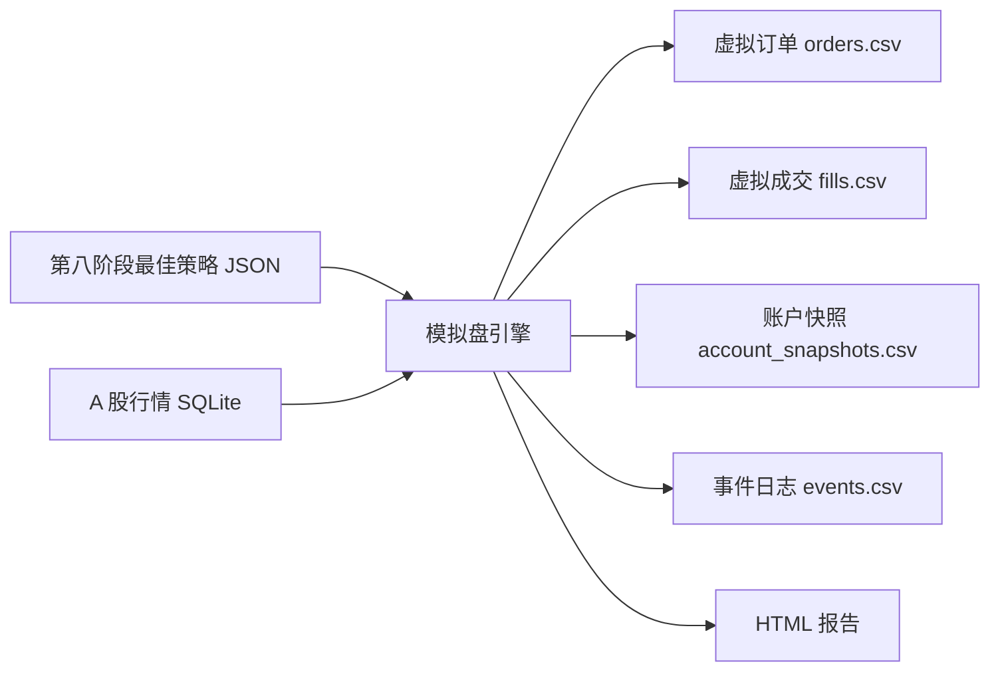

# 第九阶段交付物：模拟盘 Paper Trading MVP

版本：v0.1  
阶段：第九阶段 - 模拟交易  
日期：2026-06-20  
前置依赖：

- 第三阶段：A 股行情数据模块。
- 第四阶段：策略 DSL。
- 第五阶段：回测引擎。
- 第八阶段：参数优化结果。

目标：在不连接真实券商、不真实下单的前提下，用历史 K 线模拟实时行情推进，让策略逐根 K 线产生信号、生成虚拟订单、虚拟成交，并记录账户状态。

## 1. 阶段范围

本阶段完成模拟盘 MVP。

已完成：

- 模拟盘配置文件。
- 历史行情逐根 K 线回放。
- 读取策略 JSON。
- 买入/卖出信号判断。
- 虚拟订单生成。
- 虚拟成交生成。
- 现金、持仓、权益更新。
- 最大回撤状态记录。
- 事件日志。
- 账户快照。
- 模拟盘 HTML 报告。

暂不包含：

- 真实券商 API。
- 真实资金交易。
- 实时行情订阅。
- 订单撤单。
- 部分成交。
- A 股 T+1 交易限制。
- 涨跌停无法成交。
- 停牌处理。
- 多标的持仓。

## 2. 交付文件

| 文件 | 说明 |
|---|---|
| `simulation_module/paper_trader.py` | 模拟盘引擎 |
| `simulation_module/configs/paper_trading_price_breakout.json` | 模拟盘配置 |
| `simulation_module/output/price_breakout_paper/simulation_report.json` | 模拟盘完整报告 |
| `simulation_module/output/price_breakout_paper/orders.csv` | 虚拟订单记录 |
| `simulation_module/output/price_breakout_paper/fills.csv` | 虚拟成交记录 |
| `simulation_module/output/price_breakout_paper/account_snapshots.csv` | 账户快照 |
| `simulation_module/output/price_breakout_paper/events.csv` | 事件日志 |
| `simulation_module/output/price_breakout_paper/paper_trading_report.html` | 模拟盘 HTML 报告 |
| `simulation_module/paper-trading-delivery.md` | 第九阶段交付说明 |

## 3. 模拟盘配置

配置文件：

```text
simulation_module/configs/paper_trading_price_breakout.json
```

核心配置：

```json
{
  "simulation_id": "sim_price_breakout_paper_001",
  "strategy_path": "optimization_module/output/price_breakout_grid/candidates/candidate_022/strategy.json",
  "db_path": "data_module/market_data.sqlite",
  "mode": "historical_replay",
  "account": {
    "initial_cash": 100000,
    "allow_short": false
  }
}
```

本阶段使用第八阶段参数优化筛出的最佳候选策略：

```text
optimization_module/output/price_breakout_grid/candidates/candidate_022/strategy.json
```

## 4. 运行命令

使用 Codex 内置 Python：

```powershell
& 'C:\Users\huawei\.cache\codex-runtimes\codex-primary-runtime\dependencies\python\python.exe' simulation_module\paper_trader.py simulation_module\configs\paper_trading_price_breakout.json --output-dir simulation_module\output\price_breakout_paper
```

## 5. 输出结果

本次模拟盘结果：

| 指标 | 值 |
|---|---:|
| 初始资金 | `100000.00` |
| 最终现金 | `99819.808538` |
| 最终权益 | `99819.808538` |
| 总收益率 | `-0.1802%` |
| 最大回撤 | `0.3507%` |
| 订单数量 | `2` |
| 成交数量 | `2` |
| 最终持仓 | `0` |
| 状态 | `running` |

订单记录：

| 订单号 | 时间 | 方向 | 数量 | 价格 | 状态 | 原因 |
|---|---|---|---:|---:|---|---|
| `ORD-0001` | `2024-01-02` | buy | `11` | `1683.34125` | accepted | entry_rule |
| `ORD-0002` | `2024-01-04` | sell | `11` | `1667.9656` | accepted | exit_rule |

## 6. 数据流



## 7. 与回测的区别

| 项目 | 回测引擎 | 模拟盘 |
|---|---|---|
| 运行方式 | 一次性计算完整区间 | 按 K 线逐步推进 |
| 输出重点 | 收益指标、交易明细 | 订单、成交、账户状态、事件 |
| 用途 | 研究策略历史表现 | 验证策略运行流程 |
| 当前数据源 | 历史 K 线 | 历史 K 线回放 |
| 后续扩展 | 参数优化、报告 | 实时行情、模拟撮合、实盘前验证 |

## 8. 风险边界

本阶段不是实盘交易系统。

当前模拟盘：

- 不连接券商。
- 不发送真实订单。
- 不托管资金。
- 不构成投资建议。
- 不保证真实成交结果。

后续如果进入实盘交易阶段，需要单独设计：

- 账户权限。
- 券商接口。
- 订单风控。
- 审计日志。
- 异常熔断。
- 合规提示。

## 9. 下一步建议

下一阶段可以选择：

1. 做最小 Web 应用集成，把策略模板、回测、可视化、参数优化、模拟盘串到一个页面里。
2. 接入更长 A 股历史行情，让回测和模拟盘结果更有参考意义。
3. 增加真实交易约束，例如 A 股 T+1、100 股一手、涨跌停和停牌。

第九阶段完成后，项目已经具备“研究 -> 优化 -> 模拟运行”的完整闭环。
